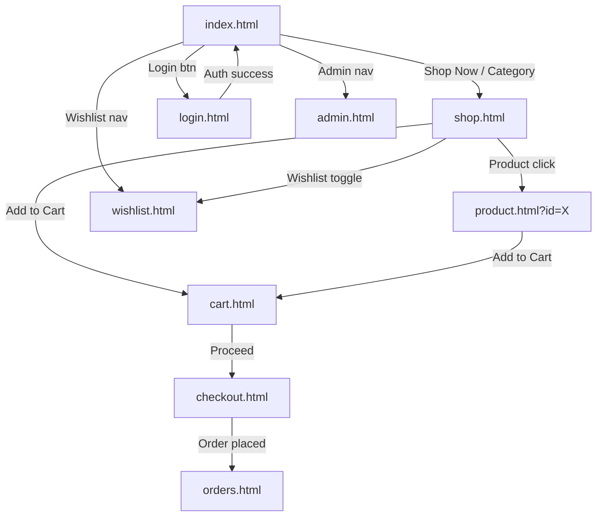
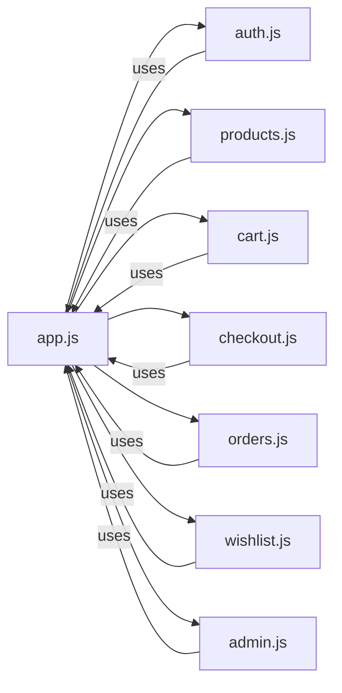

# Design Document — RZStore Online Shop

## Overview

RZStore is a fully client-side e-commerce application built with vanilla JavaScript (ES6+), Tailwind CSS (CDN), and Font Awesome (CDN). All persistence is handled through the browser's `localStorage` API; there is no backend, no build step, and no server-side rendering. The application is structured as a multi-page application (MPA) — each page is a standalone HTML file that loads shared JavaScript modules and renders its own content.

The architecture follows a **module-per-concern** pattern: each major feature area (auth, products, cart, checkout, orders, wishlist, admin) lives in its own JS file. A shared `js/app.js` module provides utilities, LocalStorage helpers, the Toast notification system, dark-mode logic, and the Navbar/cart-badge updater that every page imports.

Initial product data is seeded from `data/products.json` on first load. Subsequent reads and writes go directly to LocalStorage. The application deploys as a static site to GitHub Pages — all URLs are file-relative, and no hash-based or history-API routing is required.

### Design Goals

- Zero build tooling — open `index.html` in a browser or serve from GitHub Pages and it works.
- Consistent UI across all pages via shared Tailwind utility classes and a small `css/style.css` for custom properties and animations.
- Auth guards implemented as synchronous LocalStorage checks at the top of each protected page's JS module.
- All state mutations go through a thin LocalStorage wrapper in `app.js` to keep reads/writes consistent and debuggable.

---

## Architecture

### High-Level Page Flow



### Module Dependency Graph



Every page HTML file loads `js/app.js` first (as a module), then its own page-specific module. `app.js` exports utility functions; page modules import them. There are no circular dependencies.

### Page-to-Module Mapping

| HTML Page | Primary JS Module | Secondary Modules Used |
|---|---|---|
| `index.html` | `js/products.js` (featured) | `js/cart.js`, `js/wishlist.js` |
| `shop.html` | `js/products.js` | `js/cart.js`, `js/wishlist.js` |
| `product.html` | `js/products.js` | `js/cart.js`, `js/wishlist.js` |
| `cart.html` | `js/cart.js` | — |
| `checkout.html` | `js/checkout.js` | `js/cart.js` |
| `orders.html` | `js/orders.js` | — |
| `wishlist.html` | `js/wishlist.js` | `js/cart.js` |
| `login.html` | `js/auth.js` | — |
| `admin.html` | `js/admin.js` | `js/products.js` |

---

## Components and Interfaces

### File / Folder Structure

```
rzstore/
├── index.html
├── shop.html
├── product.html
├── cart.html
├── checkout.html
├── orders.html
├── wishlist.html
├── login.html
├── admin.html
├── css/
│   └── style.css
├── js/
│   ├── app.js          # shared utilities, LocalStorage helpers, Toast, dark mode, Navbar
│   ├── auth.js         # registration, login, logout, auth guards
│   ├── products.js     # catalog render, search/filter/sort, pagination, product detail
│   ├── cart.js         # cart CRUD, badge update, cart page render
│   ├── checkout.js     # checkout form, order creation
│   ├── orders.js       # order history render, order detail expand
│   ├── wishlist.js     # wishlist toggle, wishlist page render
│   └── admin.js        # admin dashboard, product CRUD modal, order/user tables
└── data/
    └── products.json   # seed data (≥ 20 products, ≥ 4 categories)
```

### Shared Navbar HTML Snippet (injected or static per page)

Each HTML page includes the Navbar inline (not injected via JS) to avoid a flash of missing navigation. The Navbar structure is:

```
[Logo/Store Name]   [Home] [Shop] [Wishlist] [Orders]   [🛒 badge] [🌙] [User/Login]
```

On mobile (< 768px) the center links collapse behind a hamburger `☰` button that opens a slide-in drawer overlay.

### js/app.js — Public Interface

```javascript
// LocalStorage helpers
export const Storage = {
  get(key),           // JSON.parse(localStorage.getItem(key))
  set(key, value),    // localStorage.setItem(key, JSON.stringify(value))
  remove(key),        // localStorage.removeItem(key)
};

// Toast system
export const Toast = {
  show(message, type = 'info'),  // type: 'success' | 'error' | 'info'
};

// Session helpers
export const Session = {
  get(),              // returns current user object or null
  set(user),          // saves user (without password) to rz_session
  clear(),            // removes rz_session
  isAdmin(),          // returns true if session.role === 'admin'
};

// Dark mode
export function initDarkMode();
export function toggleDarkMode();

// Navbar
export function initNavbar();   // sets cart badge, user name, logout handler
export function updateCartBadge();

// Seed
export async function seedDataIfNeeded();  // fetches products.json, seeds users
```

### js/auth.js — Public Interface

```javascript
export function requireAuth();   // redirects to login.html if no session
export function requireAdmin();  // redirects to index.html if not admin
export function initLoginPage();
export function initRegisterPage();  // login.html hosts both forms via tab toggle
export function logout();
```

### js/products.js — Public Interface

```javascript
export function getAllProducts();          // returns array from LocalStorage
export function getProductById(id);
export function getProductsByCategory(cat);
export function getFeaturedProducts(limit);
export function renderProductCard(product, options); // returns DOM element
export function initShopPage();           // wires up filters, sort, pagination
export function initProductDetailPage();  // reads ?id=, renders detail
export function initFeaturedSection();    // for index.html
```

### js/cart.js — Public Interface

```javascript
export function getCart();                // returns cart array from LocalStorage
export function addToCart(productId, qty);
export function removeFromCart(productId);
export function updateQty(productId, delta); // +1 or -1
export function clearCart();
export function getCartTotal();
export function getCartCount();
export function initCartPage();
```

### js/checkout.js — Public Interface

```javascript
export function initCheckoutPage();
export function generateTransactionId();  // 'TRX' + Date.now() + 4-digit random
export function createOrder(formData);    // validates, saves, clears cart, redirects
```

### js/orders.js — Public Interface

```javascript
export function getUserOrders(email);     // filtered by userEmail
export function initOrdersPage();
```

### js/wishlist.js — Public Interface

```javascript
export function getWishlist(email);
export function toggleWishlist(email, productId); // add or remove
export function isWishlisted(email, productId);
export function initWishlistPage();
```

### js/admin.js — Public Interface

```javascript
export function initAdminPage();
export function renderDashboard();
export function renderProductsTable();
export function openProductModal(productId);  // null = add, id = edit
export function renderOrdersTable();
export function renderUsersTable();
```

---

## Data Models

All data is stored in `localStorage`. Keys are namespaced with the `rz_` prefix.

### LocalStorage Keys

| Key | Type | Description |
|---|---|---|
| `rz_products` | `Product[]` | Full product catalog |
| `rz_users` | `User[]` | All registered users (passwords stored as plain text — acceptable for a demo app) |
| `rz_session` | `User` (no password) | Currently authenticated user |
| `rz_cart` | `CartItem[]` | Active shopping cart (per-browser, not per-user) |
| `rz_orders` | `Order[]` | All orders from all users |
| `rz_wishlist` | `WishlistMap` | Map of `{ [email]: productId[] }` |
| `rz_theme` | `"light" \| "dark"` | User's theme preference |

### Product Schema

```typescript
interface Product {
  id: string;           // e.g. "prod_001"
  name: string;
  category: string;     // e.g. "Hoodie", "Jacket", "T-Shirt", "Pants"
  price: number;        // in USD, e.g. 49.99
  image: string;        // URL or relative path
  stock: number;        // integer ≥ 0
  rating: number;       // float 0.0–5.0
  description: string;
  featured: boolean;
  tags: string[];       // e.g. ["casual", "winter", "unisex"]
  createdAt: string;    // ISO 8601 timestamp
}
```

### User Schema

```typescript
interface User {
  id: string;           // e.g. "user_001"
  name: string;
  email: string;        // unique, used as identifier
  password: string;     // plain text (demo only)
  role: "customer" | "admin";
  createdAt: string;    // ISO 8601 timestamp
}
```

### CartItem Schema

```typescript
interface CartItem {
  productId: string;
  name: string;         // denormalized for display without re-lookup
  price: number;        // snapshot price at time of add
  image: string;
  quantity: number;     // integer ≥ 1
}
```

### Order Schema

```typescript
interface Order {
  transactionId: string;  // "TRX" + Date.now() + 4-digit random, e.g. "TRX17091234565678"
  userEmail: string;
  date: string;           // ISO 8601 timestamp
  customer: {
    name: string;
    address: string;
    city: string;
    postalCode: string;
    phone: string;
  };
  items: CartItem[];
  subtotal: number;
  shipping: number;       // 0 if free, else fixed fee
  total: number;
  status: "pending" | "processing" | "shipped" | "delivered" | "cancelled";
}
```

### WishlistMap Schema

```typescript
// Stored under rz_wishlist
type WishlistMap = {
  [email: string]: string[];  // array of productId strings
};
```

---

## State Management

### Read/Write Pattern

All state mutations follow a consistent read-modify-write pattern through `Storage` helpers in `app.js`:

```javascript
// Example: add item to cart
const cart = Storage.get('rz_cart') ?? [];
const existing = cart.find(i => i.productId === productId);
if (existing) {
  existing.quantity += qty;
} else {
  cart.push({ productId, name, price, image, quantity: qty });
}
Storage.set('rz_cart', cart);
updateCartBadge();
```

### Auth Guard Pattern

Protected pages call `requireAuth()` as the first statement in their module's init function:

```javascript
// top of initCartPage(), initCheckoutPage(), etc.
export function initCartPage() {
  requireAuth();   // synchronous; redirects if no session
  // ... rest of init
}
```

`requireAdmin()` is called at the top of `initAdminPage()`.

### Cart Badge Sync

`updateCartBadge()` in `app.js` reads `rz_cart` and updates the `<span id="cart-badge">` element. It is called after every cart mutation and on every page's `DOMContentLoaded` via `initNavbar()`.

---

## Routing and Navigation Strategy

RZStore uses **file-based routing** — each page is a separate HTML file. Navigation between pages uses standard `<a href>` links and `window.location.href` assignments.

### Query Parameter Conventions

| Parameter | Used On | Purpose |
|---|---|---|
| `?id=prod_001` | `product.html` | Load specific product detail |
| `?category=Hoodie` | `shop.html` | Pre-apply category filter |
| `?search=winter` | `shop.html` | Pre-apply search filter |

Query parameters are read with:

```javascript
const params = new URLSearchParams(window.location.search);
const id = params.get('id');
```

### Auth Redirect Flow

```
Unauthenticated user → cart.html
  → requireAuth() fires
  → sessionStorage.setItem('rz_redirect', window.location.href)  [optional UX]
  → window.location.href = 'login.html'
  → After login success → redirect back or to index.html
```

---

## UI/UX Design System

### Color Palette (CSS Custom Properties in `css/style.css`)

```css
:root {
  --color-primary:     #6366f1;   /* Indigo-500 — brand accent */
  --color-primary-dark:#4f46e5;   /* Indigo-600 — hover state */
  --color-success:     #22c55e;   /* Green-500 */
  --color-error:       #ef4444;   /* Red-500 */
  --color-info:        #3b82f6;   /* Blue-500 */
  --color-warning:     #f59e0b;   /* Amber-500 */

  /* Light mode surfaces */
  --bg-base:           #f9fafb;   /* Gray-50 */
  --bg-card:           #ffffff;
  --text-primary:      #111827;   /* Gray-900 */
  --text-secondary:    #6b7280;   /* Gray-500 */
  --border:            #e5e7eb;   /* Gray-200 */
}

[data-theme="dark"] {
  --bg-base:           #0f172a;   /* Slate-900 */
  --bg-card:           #1e293b;   /* Slate-800 */
  --text-primary:      #f1f5f9;   /* Slate-100 */
  --text-secondary:    #94a3b8;   /* Slate-400 */
  --border:            #334155;   /* Slate-700 */
}
```

### Typography Scale

| Role | Tailwind Class | Size |
|---|---|---|
| Page title | `text-3xl font-bold` | 30px |
| Section heading | `text-2xl font-semibold` | 24px |
| Card title | `text-lg font-medium` | 18px |
| Body | `text-base` | 16px |
| Caption / badge | `text-sm` | 14px |
| Micro | `text-xs` | 12px |

Font family: system-ui stack via Tailwind default (`font-sans`).

### Spacing Scale

Tailwind's default 4px base unit is used throughout. Key layout values:
- Page horizontal padding: `px-4 sm:px-6 lg:px-8`
- Section vertical gap: `py-12 lg:py-16`
- Card padding: `p-4`
- Grid gap: `gap-4 lg:gap-6`

### Border Radius

- Cards, modals: `rounded-xl` (12px)
- Buttons: `rounded-lg` (8px)
- Badges, tags: `rounded-full`
- Inputs: `rounded-md` (6px)

### Tailwind CDN Configuration

A `<script>` block before the Tailwind CDN link extends the default config with the brand color and dark mode strategy:

```html
<script>
  tailwind.config = {
    darkMode: 'class',   // toggled via data-theme on <html>
    theme: {
      extend: {
        colors: {
          primary: { DEFAULT: '#6366f1', dark: '#4f46e5' }
        }
      }
    }
  }
</script>
<script src="https://cdn.tailwindcss.com"></script>
```

Dark mode is driven by adding/removing the `dark` class on `<html>` (Tailwind `darkMode: 'class'`), which is set by `initDarkMode()` in `app.js` before first paint.

---

## Page-by-Page Component Breakdown

### index.html — Landing Page

```
<Navbar>
<Hero_Section>
  - Full-width gradient background
  - H1 headline + subheadline
  - "Shop Now" CTA → shop.html
  - Decorative product image (right side, hidden on mobile)
<Category_Section>
  - 4-column grid (2 on mobile)
  - Each card: icon + category name + product count
  - Click → shop.html?category=X
<Featured_Products_Section>
  - Section heading + "View All" link → shop.html
  - Responsive grid of up to 8 Product_Cards
<Footer>
```

### shop.html — Product Catalog

```
<Navbar>
<main class="container">
  <aside> (filter sidebar, collapses to drawer on mobile)
    - Category filter (radio buttons)
    - Price range (min/max inputs)
    - "Clear Filters" button
  </aside>
  <section>
    - Search input (top)
    - Sort dropdown (top-right)
    - Product grid (1/2/3-4 cols responsive)
    - Empty state (if no results)
    - <Pagination_Component>
  </section>
</main>
<Footer>
```

### product.html — Product Detail

```
<Navbar>
<main>
  <Breadcrumb> Home > Shop > {category} > {name}
  <ProductDetail>
    - Large image (left col)
    - Name, category badge, rating stars, price (right col)
    - Stock badge ("In Stock" / "Out of Stock")
    - Description
    - Quantity selector + "Add to Cart" button
    - "Add to Wishlist" toggle button
  </ProductDetail>
  <RelatedProducts>
    - Up to 4 Product_Cards from same category
  </RelatedProducts>
</main>
<Footer>
```

### cart.html — Shopping Cart

```
<Navbar>
<main>
  [Empty state OR]
  <CartTable>
    - Rows: image | name | unit price | qty controls | subtotal | remove
  </CartTable>
  <OrderSummary>
    - Subtotal, Shipping, Grand Total
    - "Proceed to Checkout" button → checkout.html
    - "Continue Shopping" link → shop.html
</main>
<Footer>
```

### checkout.html — Checkout

```
<Navbar>
<main class="two-col">
  <CheckoutForm> (left)
    - Full Name, Address, City, Postal Code, Phone
    - "Place Order" submit button
  </CheckoutForm>
  <OrderSummary> (right)
    - Item list with qty and price
    - Subtotal, Shipping, Total
</main>
<Footer>
```

### orders.html — Order History

```
<Navbar>
<main>
  [Empty state OR]
  <OrdersTable>
    - Rows: TRX ID | Date | Items | Total | Status badge | "View" button
    - Expandable detail row: items table + shipping address
  </OrdersTable>
</main>
<Footer>
```

### wishlist.html — Wishlist

```
<Navbar>
<main>
  [Empty state OR]
  <WishlistGrid>
    - Product_Cards with "Remove from Wishlist" and "Add to Cart" buttons
  </WishlistGrid>
</main>
<Footer>
```

### login.html — Authentication

```
<main class="centered-card">
  <TabToggle> [Login] [Register]
  <LoginForm>
    - Email, Password, "Login" button
    - Error message area
  </LoginForm>
  <RegisterForm> (hidden until tab switch)
    - Full Name, Email, Password, "Register" button
    - Error message area
</main>
```

No Navbar/Footer on login page — clean centered layout.

### admin.html — Admin Panel

```
<AdminLayout>
  <Sidebar>
    - Store logo
    - Nav items: Dashboard, Products, Orders, Users
    - Logout button
  </Sidebar>
  <MainContent>
    [Dashboard view]
      - 4 stat cards: Total Products, Total Orders, Total Users, Total Revenue
      - Recent orders mini-table (last 5)
    [Products view]
      - "Add Product" button
      - Products table: thumbnail | name | category | price | stock | Edit | Delete
      - <ProductModal> (add/edit)
    [Orders view]
      - Orders table: TRX ID | Customer | Date | Total | Status dropdown | View
      - <OrderDetailModal>
    [Users view]
      - Users table: Name | Email | Role | Registered
  </MainContent>
</AdminLayout>
```

---

## Toast Notification System

### Design

Toasts are rendered in a fixed container anchored to the bottom-right of the viewport:

```html
<div id="toast-container"
     class="fixed bottom-4 right-4 z-50 flex flex-col gap-2 pointer-events-none">
</div>
```

Each toast is a `<div>` with:
- Left-border color accent (green/red/blue)
- Icon (Font Awesome: `fa-check-circle` / `fa-times-circle` / `fa-info-circle`)
- Message text
- Close button (`×`)
- CSS slide-in animation (`translateX(100%) → translateX(0)`)

### Lifecycle

```javascript
Toast.show(message, type) {
  1. Create toast element with correct color class and icon
  2. Append to #toast-container
  3. Trigger CSS enter animation (requestAnimationFrame)
  4. Set setTimeout(dismiss, 3000)
  5. Attach click listener → dismiss immediately
}

dismiss(toastEl) {
  1. Add exit animation class
  2. On animationend → remove element from DOM
}
```

### CSS Animations (in `css/style.css`)

```css
@keyframes toast-in  { from { transform: translateX(110%); opacity: 0; }
                        to   { transform: translateX(0);    opacity: 1; } }
@keyframes toast-out { from { transform: translateX(0);    opacity: 1; }
                        to   { transform: translateX(110%); opacity: 0; } }
.toast-enter { animation: toast-in  0.3s ease forwards; }
.toast-exit  { animation: toast-out 0.25s ease forwards; }
```

---

## Dark Mode Implementation

### Strategy

Dark mode uses Tailwind's `darkMode: 'class'` strategy. The `dark` class is toggled on the `<html>` element. This means every Tailwind `dark:` variant applies when `<html class="dark">` is present.

### Initialization (runs before first paint)

```html
<!-- In <head> of every HTML page, before any CSS -->
<script>
  (function() {
    const theme = localStorage.getItem('rz_theme');
    if (theme === 'dark') document.documentElement.classList.add('dark');
  })();
</script>
```

This inline script prevents FOUC (flash of unstyled content) by applying the dark class synchronously before the browser paints.

### Toggle

```javascript
export function toggleDarkMode() {
  const html = document.documentElement;
  const isDark = html.classList.toggle('dark');
  Storage.set('rz_theme', isDark ? 'dark' : 'light');
  // update toggle button icon
}
```

### Tailwind Usage Pattern

All components use paired light/dark classes:

```html
<div class="bg-white dark:bg-slate-800 text-gray-900 dark:text-slate-100 border border-gray-200 dark:border-slate-700">
```

---

## Pagination Component

### State

```javascript
const paginationState = {
  currentPage: 1,
  itemsPerPage: 12,
  totalItems: 0,   // set after filtering
};
```

### Render Function

```javascript
function renderPagination(container, state, onPageChange) {
  const totalPages = Math.ceil(state.totalItems / state.itemsPerPage);
  // renders: [Prev] [1] [2] ... [N] [Next]
  // disables Prev on page 1, Next on last page
  // highlights current page button
}
```

### Integration with Shop Page

1. `initShopPage()` applies filters/sort → gets `filteredProducts[]`
2. Updates `paginationState.totalItems = filteredProducts.length`
3. Slices: `const page = filteredProducts.slice((currentPage-1)*12, currentPage*12)`
4. Renders product grid with sliced array
5. Calls `renderPagination(...)` with `onPageChange` callback that re-runs steps 3–5
6. On filter/sort change: resets `currentPage = 1` then re-runs all steps

---

## Admin Panel Architecture

### Sidebar Navigation

The sidebar is a fixed-width left panel (`w-64`) with nav items that toggle visibility of content sections:

```javascript
// Each nav item sets a data-section attribute
document.querySelectorAll('[data-nav]').forEach(btn => {
  btn.addEventListener('click', () => {
    showSection(btn.dataset.nav);  // 'dashboard' | 'products' | 'orders' | 'users'
  });
});
```

On mobile (< 768px) the sidebar collapses to a top tab bar.

### Dashboard Stats

Stats are computed on render from LocalStorage:

```javascript
function getDashboardStats() {
  const products = Storage.get('rz_products') ?? [];
  const orders   = Storage.get('rz_orders')   ?? [];
  const users    = Storage.get('rz_users')    ?? [];
  const revenue  = orders.reduce((sum, o) => sum + o.total, 0);
  return { products: products.length, orders: orders.length,
           users: users.length, revenue };
}
```

### Product CRUD Modal

A single `<dialog>` element (or `<div>` overlay) is reused for both Add and Edit:

```javascript
openProductModal(productId = null) {
  const isEdit = productId !== null;
  const product = isEdit ? getProductById(productId) : {};
  // populate form fields with product data or empty strings
  // set modal title to "Add Product" or "Edit Product"
  // set form submit handler to saveProduct(productId)
  modal.showModal();  // or classList.remove('hidden')
}
```

On submit, `saveProduct()` validates required fields, then either pushes a new product (with generated `id`) or replaces the existing one in the `rz_products` array.

### Order Status Management

Each row in the orders table has an inline `<select>` for status. On `change`:

```javascript
select.addEventListener('change', (e) => {
  const orders = Storage.get('rz_orders');
  const order = orders.find(o => o.transactionId === txId);
  order.status = e.target.value;
  Storage.set('rz_orders', orders);
  Toast.show('Order status updated', 'success');
});
```

---

## Error Handling

| Scenario | Handling |
|---|---|
| `data/products.json` fetch fails | Log error, show Toast error, continue with empty catalog |
| Product not found (`?id=` invalid) | Render "Product not found" message with back link |
| LocalStorage quota exceeded | Catch `QuotaExceededError`, show Toast error |
| Unauthenticated access to protected page | Synchronous redirect to `login.html` |
| Non-admin access to `admin.html` | Synchronous redirect to `index.html` |
| Checkout with empty cart | Redirect to `cart.html` with Toast warning |
| Form validation failure | Inline error messages below each invalid field; no Toast |
| Cart item product deleted by admin | On cart render, filter out items whose `productId` no longer exists in `rz_products` |

---

## Testing Strategy

### Dual Testing Approach

The testing strategy combines **example-based unit tests** for specific behaviors and **property-based tests** for universal correctness properties.

- **Unit tests**: Verify specific examples, edge cases, and error conditions using a framework like Jest or Vitest.
- **Property-based tests**: Verify universal properties across many generated inputs using [fast-check](https://github.com/dubzzz/fast-check) (JavaScript PBT library).

### Unit Test Coverage Areas

- `generateTransactionId()` — format matches `TRX\d+` pattern
- `Auth_Module` validation — empty fields, short password, duplicate email
- `Cart_Module` — add, remove, update quantity, total calculation
- `Wishlist_Module` — toggle add/remove, per-user isolation
- `Pagination_Component` — page slicing, boundary button states
- `Admin_Product_Manager` — form validation, CRUD operations

### Property-Based Test Configuration

- Library: **fast-check** (loaded via CDN or npm for test environment)
- Minimum **100 iterations** per property test
- Each test tagged with: `// Feature: online-shop, Property N: <property text>`


---

## Correctness Properties

*A property is a characteristic or behavior that should hold true across all valid executions of a system — essentially, a formal statement about what the system should do. Properties serve as the bridge between human-readable specifications and machine-verifiable correctness guarantees.*

### Property 1: Password Length Validation

*For any* string submitted as a registration password, the validation function SHALL accept it if and only if its length is greater than or equal to 6 characters, and SHALL reject it otherwise — regardless of the string's content.

**Validates: Requirements 3.2**

---

### Property 2: Duplicate Email Prevention

*For any* existing array of registered users and any email string, the registration function SHALL reject the registration if and only if the email already exists in the users array (case-insensitive comparison), leaving the users array unchanged.

**Validates: Requirements 3.3**

---

### Property 3: Registration Produces Correct User Shape

*For any* valid registration input (name, email, password of length ≥ 6) that does not duplicate an existing email, the saved user object SHALL contain exactly the fields `id`, `name`, `email`, `password`, `role: "customer"`, and `createdAt`, and the session object written on login SHALL contain all fields except `password`.

**Validates: Requirements 3.4, 3.6**

---

### Property 4: Login Credential Matching

*For any* array of registered users and any (email, password) pair submitted to the login function, the function SHALL create a session if and only if there exists a user in the array whose `email` and `password` fields exactly match the submitted pair.

**Validates: Requirements 3.6, 3.7**

---

### Property 5: Seed Idempotence (No Overwrite)

*For any* non-empty array already stored under `rz_products` in LocalStorage, calling the seed function SHALL leave the `rz_products` array byte-for-byte identical to its pre-call state — the seed function SHALL NOT modify existing product data.

**Validates: Requirements 4.3**

---

### Property 6: Search Filter Correctness

*For any* array of products and any non-empty search query string, every product returned by the search filter function SHALL contain the query string (case-insensitive) in either its `name` field or at least one element of its `tags` array, and no product that does not satisfy this condition SHALL appear in the results.

**Validates: Requirements 5.3**

---

### Property 7: Category Filter Correctness

*For any* array of products and any category string, every product returned by the category filter function SHALL have a `category` field that exactly matches the selected category, and no product from a different category SHALL appear in the results.

**Validates: Requirements 5.4**

---

### Property 8: Price Range Filter Correctness

*For any* array of products and any valid price range [min, max] where min ≤ max, every product returned by the price range filter SHALL have a `price` field satisfying `min ≤ price ≤ max`, and no product outside this range SHALL appear in the results.

**Validates: Requirements 5.5**

---

### Property 9: Pagination Slice Correctness

*For any* array of N products and any page number P (1-indexed), the paginated slice returned by the pagination function SHALL contain exactly `min(12, N - (P-1)*12)` items, starting at index `(P-1)*12` of the sorted/filtered array, and the items SHALL preserve their original relative order.

**Validates: Requirements 5.8, 18.1, 18.4**

---

### Property 10: Pagination Boundary Button States

*For any* total item count and current page number, the "Previous" button SHALL be disabled if and only if the current page is 1, and the "Next" button SHALL be disabled if and only if the current page equals `ceil(totalItems / 12)` (the last page).

**Validates: Requirements 18.2, 18.3**

---

### Property 11: Cart Quantity Delta

*For any* cart array and any item in the cart with quantity Q:
- Calling `updateQty(productId, +1)` SHALL result in that item having quantity Q+1, with all other items unchanged.
- Calling `updateQty(productId, -1)` when Q > 1 SHALL result in that item having quantity Q-1, with all other items unchanged.
- Calling `updateQty(productId, -1)` when Q = 1 SHALL remove the item from the cart entirely, with all other items unchanged.

**Validates: Requirements 7.3, 7.4, 7.5**

---

### Property 12: Cart Total Calculation

*For any* cart array, `getCartTotal()` SHALL return a value equal to the sum of `(item.price * item.quantity)` for every item in the cart, plus the applicable shipping fee — and this calculation SHALL hold for any combination of item prices, quantities, and cart sizes.

**Validates: Requirements 7.7**

---

### Property 13: Transaction ID Format

*For any* call to `generateTransactionId()`, the returned string SHALL match the regular expression `/^TRX\d{13,}\d{4}$/` (the `TRX` prefix followed by a millisecond-precision timestamp and a 4-digit random suffix), and no two calls within the same millisecond SHALL produce the same string (due to the random suffix).

**Validates: Requirements 8.4**

---

### Property 14: Order Completeness

*For any* valid checkout form submission with a non-empty cart, the order object saved to `rz_orders` SHALL contain all required fields: `transactionId`, `userEmail`, `date`, `customer` (with `name`, `address`, `city`, `postalCode`, `phone`), `items` (matching the cart contents), `subtotal`, `shipping`, `total`, and `status: "pending"` — and the cart SHALL be empty after the order is created.

**Validates: Requirements 8.5, 8.6**

---

### Property 15: Order User Isolation

*For any* array of orders belonging to multiple users and any user email E, `getUserOrders(E)` SHALL return exactly the subset of orders where `order.userEmail === E`, and SHALL NOT include any order belonging to a different user.

**Validates: Requirements 9.1**

---

### Property 16: Wishlist Toggle Round-Trip

*For any* wishlist state, user email, and product ID:
- If the product is NOT in the user's wishlist, calling `toggleWishlist(email, productId)` SHALL add it, and `isWishlisted(email, productId)` SHALL return `true`.
- If the product IS in the user's wishlist, calling `toggleWishlist(email, productId)` SHALL remove it, and `isWishlisted(email, productId)` SHALL return `false`.
- Calling `toggleWishlist` twice in succession SHALL return the wishlist to its original state (round-trip identity).

**Validates: Requirements 10.2, 10.3**

---

### Property 17: Wishlist User Isolation

*For any* two distinct user emails E1 and E2, and any product ID, adding a product to E1's wishlist SHALL NOT cause that product to appear in E2's wishlist, and removing a product from E1's wishlist SHALL NOT affect E2's wishlist.

**Validates: Requirements 10.4**

---

### Property 18: Dark Mode Persistence Round-Trip

*For any* theme value (`"light"` or `"dark"`), after calling `toggleDarkMode()` to set the theme and then calling `initDarkMode()` (simulating a page reload), the `<html>` element SHALL have the `dark` class present if and only if the stored theme is `"dark"`, with no flash of the opposite theme.

**Validates: Requirements 12.4, 12.5**

---

### Property 19: Admin Product ID Uniqueness

*For any* existing array of products in LocalStorage and any new product form data, the product saved by `saveProduct()` SHALL be assigned an `id` that does not already exist in the products array, ensuring global uniqueness across all add operations.

**Validates: Requirements 14.5**

